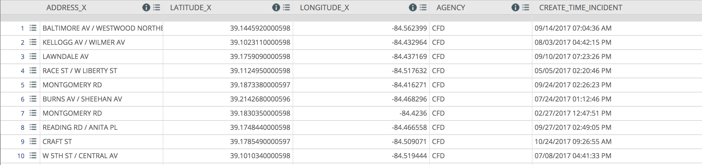
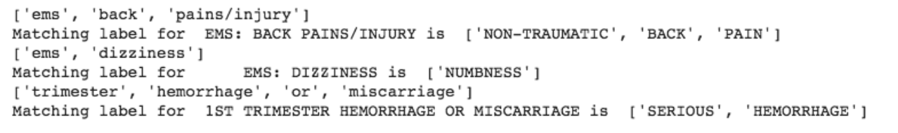
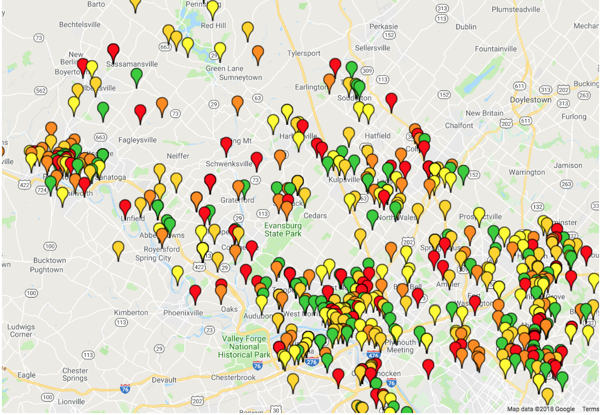

# NLP-for-Ambulance-Calls

# A program which takes in text and, using key words and ranks ambulance calls in order of importance and proximity using natural language processing

First, the program will input an ambulance call in the form of a csv (comma separated values) which features including latitude, longitude, description, etc. A couple examples we used can be found below: 
https://data.cincinnati-oh.gov/Safer-Streets/Cincinnati-Fire-Incidents-CAD-including-EMS-ALS-BL/vnsz-a3wp/data
https://data.marincounty.org/Public-Health/Emergency-Medical-Service-Incidents/swth-izpe
Here is an example of what such a data set would look like. 

Then, the program runs the data set through a word2vec program which finds related key words. This is what that output should be similar to. 

The program then runs this through a priority algorithm which ranks the calls according to Medical Priority Dispatch Codes, which can be located here: https://wiki.radioreference.com/index.php/Priority_Dispatch_Codes

After ranking, using gmplot, which can be located here: https://github.com/vgm64/gmplot , the program maps the priorities to a map, using a different color for each priority. 

